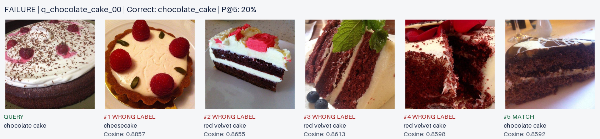
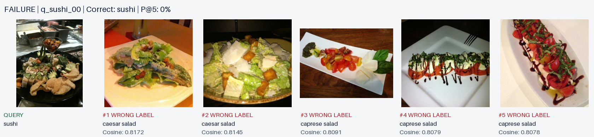
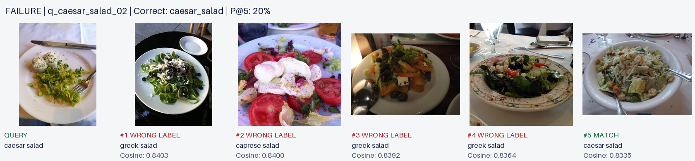

# Food image search

Upload a food photo to retrieve the five most similar catalog images with cosine scores. This project compares pretrained and fine-tuned CLIP with full-image, random-crop, and YOLO-crop search.

## Key result

**Fine-tuned CLIP + full image + YOLO achieves Precision@5 of 0.9507 ± 0.0064,** compared with 0.7967 for baseline full-image CLIP. Crops alone perform worse than full-image search with the fine-tuned model.

Values below are **mean ± sample SD across five training seeds** with fixed split and crop seeds. The pretrained baseline is unchanged across runs, so its SD is zero.


| Encoder             | Query strategy              | Precision@5             | Recall@5                | NDCG@5                  |
| ------------------- | --------------------------- | ----------------------- | ----------------------- | ----------------------- |
| Baseline CLIP       | Full image                  | 0.796667 ± 0.000000     | 0.039833 ± 0.000000     | 0.791588 ± 0.000000     |
| Baseline CLIP | Random crops | 0.761333 ± 0.000000 | 0.038067 ± 0.000000 | 0.766496 ± 0.000000 |
| Baseline CLIP       | YOLO crops                  | 0.713333 ± 0.000000     | 0.035667 ± 0.000000     | 0.715367 ± 0.000000     |
| Baseline CLIP       | Full image + YOLO crops     | 0.816667 ± 0.000000     | 0.040833 ± 0.000000     | 0.818405 ± 0.000000     |
| Fine-tuned CLIP     | Full image                  | 0.930000 ± 0.006667     | 0.046500 ± 0.000333     | 0.926348 ± 0.009345     |
| Fine-tuned CLIP | Random crops | 0.874533 ± 0.006279 | 0.043727 ± 0.000314 | 0.874687 ± 0.005227 |
| Fine-tuned CLIP     | YOLO crops                  | 0.804000 ± 0.004346     | 0.040200 ± 0.000217     | 0.805235 ± 0.004343     |
| **Fine-tuned CLIP** | **Full image + YOLO crops** | **0.950667 ± 0.006412** | **0.047533 ± 0.000321** | **0.949800 ± 0.008211** |


Inspect the [summary CSV](outputs/seed_study/summary.csv) or [per-seed results](outputs/seed_study/summary.json). The reproduction command generates the visual comparison at `outputs/reproduced/comparison/index.html` (preselected seed 0).

## Methodology

1. **Baseline CLIP.** Retrieve images by cosine similarity. Visually similar dishes are confused, motivating food-specific fine-tuning.
2. **Fine-tuned CLIP.** Train the image projection with the backbone frozen. Retrieval improves, but one whole-image embedding can mix several dishes.
3. **Random crops.** Search five random crops separately and average their evaluation metrics; no best crop is selected. Fine-tuned retrieval is worse than full-image search; crops can miss food or remove useful context.
4. **YOLO crops only.** Detect regions without text prompts and search their rectangular crops. Retrieval drops further because detections can miss the main dish or select other objects.
5. **YOLO crops + full image.** Include the original photo in max-cosine fusion to retain context. This gives the best measured result, although irrelevant crops can still win.

## Try the UI

Install uv using [Setup](#setup-and-reproduction), then run these commands from the repository root on **macOS Intel/Apple Silicon, Windows x64 (PowerShell), or Linux x64**:

```bash
uv sync --locked --python 3.11
uv run setup_project.py
uv run search_ui.py --open
```

`setup_project.py` prepares missing data/indexes and checks both encoders plus YOLO using a real query. Existing complete artifacts are reused; a fresh checkout requires internet and time to download data/models and train. The final command starts the backend and opens the UI at [localhost:8000](http://127.0.0.1:8000). Upload a photo to inspect matches, cosine scores, and winning crops. Keep the terminal running; stop with Ctrl+C. For missing dependencies or artifacts, see [Setup and reproduction](#setup-and-reproduction).

The UI uses the original seed-42 checkpoint; the linked visual report uses preselected seed 0. The table summarizes all five training seeds.

## Evaluation

Evaluate 60 queries against 2,000 catalog images; matching dish labels are relevant. Report mean Precision@5, Recall@5, and NDCG@5 across queries. Random averages metrics from five separate crop rankings. YOLO modes use maximum cosine per catalog candidate to produce one Top-5 list. YOLO falls back to the full image when no regions are detected.

Train on 1,600 images; select checkpoints using NDCG@5 on 400 validation images, without evaluation query labels. Train seeds 0–4 share split and crop seed 42. Results show mean ± sample SD across five runs.

## Three baseline failures

**Chocolate cake —** `q_chocolate_cake_00`**, Precision@5 = 0.20.** Cheesecake ranks first, followed by red velvet cakes; chocolate cake appears fifth. Pale frosting and red decoration may outweigh the chocolate-specific appearance.



**Sushi —** `q_sushi_00`**, Precision@5 = 0.00.** All five results are salads. The busy platter and green garnish may dominate the whole-image representation. Fine-tuned full-image search succeeds here, but YOLO-only misses much of the target, supporting retention of the full image.



**Caesar salad —** `q_caesar_salad_02`**, Precision@5 = 0.20.** Greek and caprese salads rank ahead of Caesar salad. Shared greens, pale ingredients, and plating may obscure category-specific cues.



## Limitations

The 60 queries were inspected during development, so results are not an untouched generalization test. One label per photo cannot evaluate every item in a shared meal. YOLO can miss food, and max fusion can promote irrelevant crops. YOLO adds detection cost and uses a variable number of crops; random uses five. Five training seeds use one fixed split and crop seed; their SD is not a confidence interval or a measure of generalization to new datasets.

## Setup and reproduction

Use Python 3.11 on a 64-bit machine; no GPU is required. A fresh-environment inference check was run on macOS Apple Silicon. Dependency resolution was also checked for Windows x64, macOS Intel, and Linux x64; native inference on those systems has not yet been tested. Intel Macs use PyTorch 2.2.2; other targets retain 2.8.0. Initial downloads require internet access.

Install uv if needed. **macOS / Linux:**

```bash
curl -LsSf https://astral.sh/uv/install.sh | sh
export PATH="$HOME/.local/bin:$PATH"
```

**Windows PowerShell** (reopen the terminal afterward):

```powershell
winget install --id=astral-sh.uv -e
```


### Linux system libraries

On Ubuntu/Debian without desktop libraries, install OpenCV's system dependencies before the quickstart:

```bash
sudo apt-get update
sudo apt-get install -y libgl1 libglib2.0-0
```

### Verify supplied artifacts

The quickstart works with supplied artifacts or a fresh checkout. To check existing artifacts without preparing data or training:

```bash
uv run setup_project.py --check
```

An incomplete existing dataset is reported without overwriting it. `prepare_data.py` and its output remain unchanged. For a baseline CLI search:

```bash
uv run image_search.py search food_search_dataset/queries/q_pho_00.jpg --top-k 5
```

### Reproduce the experiments

Run all five training seeds and eight pipelines:

```bash
uv run train_seed_study.py --out outputs/reproduced
```

New results and the visual report go to `outputs/reproduced/`; submitted summaries stay in `outputs/seed_study/`. Choose an unused `--out` for another training run, or use `--evaluate-only` with an existing complete run.

## Code and artifacts


| File                                         | Role                                    |
| -------------------------------------------- | --------------------------------------- |
| `prepare_data.py`                            | Supplied dataset preparation            |
| `setup_project.py`                           | Prepare missing assets and verify inference |
| `image_search.py`                            | CLIP embeddings and exact NumPy search  |
| `finetune_clip.py`                           | Projection training and validation      |
| `train_seed_study.py`                        | Five training seeds, mean and sample SD |
| `detect_food.py`                             | Automatic YOLO regions                  |
| `evaluate_search.py`, `compare_pipelines.py` | Metrics and experiments                 |
| `show_search_cases.py`                       | Reproducible case exports               |
| `search_ui.py`, `ui/index.html`              | Upload API and interface                |


Run tests with `uv run python -m unittest discover -s tests -v`.

The UI needs `food_search_dataset/`, `outputs/catalog.npz`, and `outputs/tuned/`. Keep `projection.npy` beside the trained index and retain `transform.npy` for comparisons. The five-seed results are in `outputs/seed_study/`; baseline failure examples are in `outputs/cases/`. Submit the Git repository. Git includes the three failure images and compact result summaries. The dataset, model indexes, and full generated reports are excluded and regenerated using `setup_project.py` and the experiment commands above. Pretrained weights download on first use. Include the required 3–5 minute screen recording, showing at least one failed query, with the submission. Report image links require these artifacts; CLI search and case export resolve image filenames against the local dataset.

## AI assistance

AI assisted implementation, tests, training, reports, UI, and documentation. Manual crops and prompt-based detection were rejected for automatic image-only use. An indexing mismatch was corrected with consistent CPU inference. An early explanation blaming drinks was revised after inspecting the data, and winning-input scores were added to make crop selection auditable. Negative results are retained alongside improvements.
